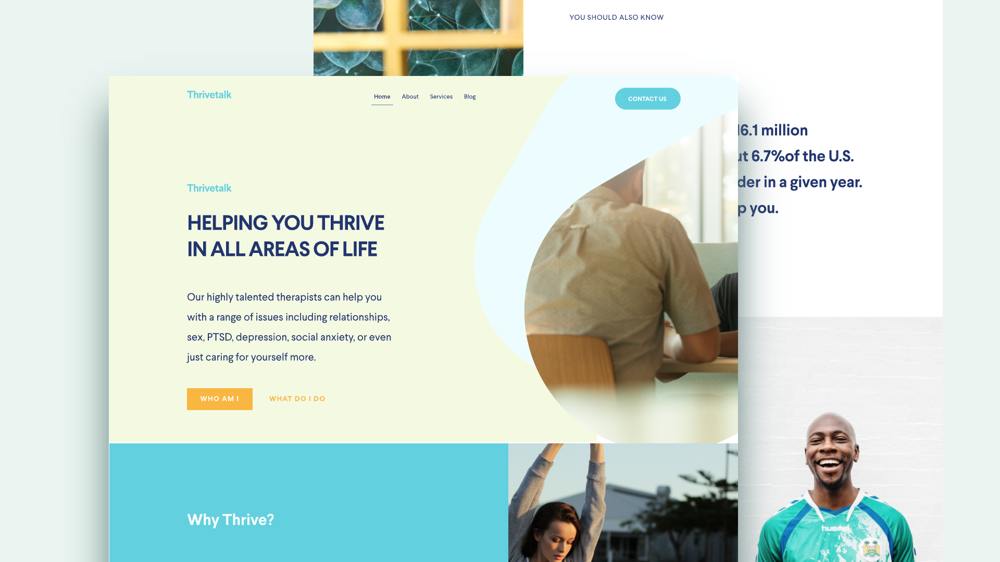

# Thrivetalk — Online Therapy Landing Page

💡 *Helping you thrive in all areas of life*

This is a responsive landing page designed for **Thrivetalk**, an online therapy service that connects users with licensed mental health professionals. The page highlights the service’s benefits and encourages visitors to begin therapy from the comfort of their home.

---

## 🧠 About

> Our highly talented therapists can help you with a range of issues including relationships, sex, PTSD, depression, social anxiety, or even just caring for yourself more.

Whether you're looking for someone to talk to or struggling with a mental wellness issue, ThriveTalk is here to help. Our platform enables high-quality online therapy via laptop or mobile, anytime, anywhere.

---

## 🚀 Getting Started

To view the landing page:

1. Clone or download this repository.
2. Open `index.html` in any modern browser.

No build tools or dependencies are required — it's a static HTML/CSS/JS site.

---

## 🛠️ Technologies Used

- **HTML5**  
- **CSS3**

---

## 📸 Preview

  
*Add a screenshot or a gif here if desired.*

---

## 📄 License

This project is licensed under the [MIT License](LICENSE).  
You are free to use, modify, and distribute the code, with proper attribution.

---

## 👤 Author

Developed by [Ilia Yaminskiy]  
Year: 2025